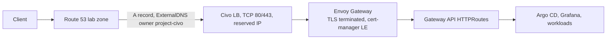
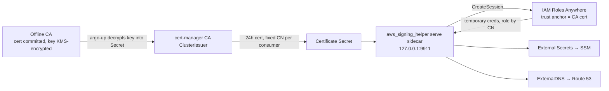
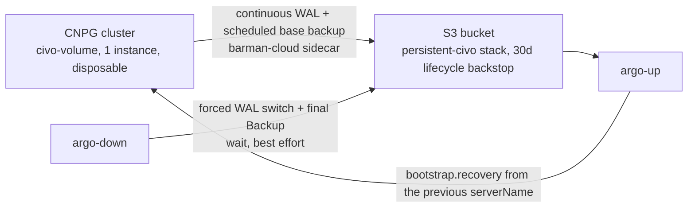

# Civo as a second provider — high-level design

**Status:** Living design document. Decisions below are dated; the detailed
planning package is `specs/civo/` (start at `specs/civo/README.md`).
**Inspected baseline:** branch `main`, commit `cfbb59bd340b6356bad3fb2493b41fa3a337efe5` (2026-09-06).

## 1. Purpose

Run the same platform (Argo CD, Envoy Gateway, CloudNativePG, External
Secrets, ExternalDNS, observability) on Civo managed Kubernetes next to the
existing AWS/EKS target, from one repository and one operator surface. AWS
stays the control plane for everything cheap and already built: Route 53,
SSM Parameter Store, KMS, the S3 state bucket, GitHub OIDC. Civo replaces
only the expensive compute path: EKS control plane, NLB, EC2 nodes, EBS.

Civo is a Kubernetes target, not a migration off AWS services.

Hetzner Cloud extends the same model as a third target (`PROVIDER=hetzner`),
differing in one respect: it sells no managed Kubernetes, so the platform
bootstraps the control plane itself, with k3s installed from each node's
own cloud-init (ADR 0036, ADR 0037).

## 2. Fixed constraints

| Constraint | Value | Decided |
|---|---|---|
| Operator surface | `PROVIDER=aws\|civo` on the existing `make` targets; default `aws`; no new lifecycle commands | 2026-09-06 |
| Civo project identity | `PROVIDER=civo` defaults `PROJECT_NAME=vk-civo-lab` and `SUBDOMAIN=civo`: own state bucket `vk-civo-lab-tf-state`, own zone `civo.<root-domain>`, own SSM prefix. Only the account layer is shared with the AWS project | 2026-09-06 |
| Stage model | Identical on both providers: `account-up` → `bootstrap-up` → `persistent-up` → `cluster-up` → `argo-up` (and the reverse) | 2026-09-06 |
| Cost target on Civo | 60–80 USD/month idle, all-in (nodes, LB, CNPG volume). Soft ceiling; bursts allowed. Measured 2026-09-17 (CIVO-160): the full observability profile runs on the three Medium nodes, but memory is tight, so CIVO-175 right-sizes before any node is added | 2026-09-06 |
| Node plan | One pool of `g4s.kube.medium` nodes (2 vCPU / 4 GB each; 2308 MiB allocatable per node, measured in CIVO-020 and again in CIVO-160). Terraform creates it at two nodes; the cluster autoscaler holds it between 2 and 3 (CIVO-170). The autoscaler carries a Civo API key in `kube-system`, and a Civo key is account-wide — accepted for this single-operator lab | 2026-09-20 |
| AWS workload identity from Civo | IAM Roles Anywhere; no long-lived AWS keys in workloads | 2026-09-06 |
| CA topology (M1) | Single offline CA: certificate committed, key KMS-encrypted in `secrets/` | 2026-09-06 |
| Civo API token | KMS-encrypted in repo (`secrets/civo-token.enc`), decrypted at run time, masked in CI; no GitHub secret, no SSM copy | 2026-09-06 |
| DNS | Route 53 stays authoritative; ExternalDNS writes from both providers with distinct owner IDs | 2026-09-06 |
| TLS on Civo | Terminated at Envoy Gateway with cert-manager + Let's Encrypt (HTTP-01 through Gateway API) | 2026-09-06 |
| Civo region | `LON1` default; `FRA1` alternative; declared once per layer, never derived | 2026-09-06 |
| Observability on Civo | Full profile in M1 on the three Medium nodes. It runs, but 2 of 3 nodes used more memory than allocatable on 2026-09-17 (CIVO-160); CIVO-175 right-sizes | 2026-09-06 |
| AWS regression | AWS behavior stays byte-identical throughout; proven by a golden render diff and the existing lifecycle test | 2026-09-06 |
| Repository rule | Platform-only; no business application code | existing |

## 3. Stage model per provider

| Stage | `make` targets | AWS (`PROVIDER=aws`, default) | Civo (`PROVIDER=civo`) | Hetzner (`PROVIDER=hetzner`) |
|---|---|---|---|---|
| Account (shared, once per AWS account, free) | `account-up/down` | KMS key, GitHub OIDC, `lab-role`, `eks-access-identity`, `root-domain` | Unchanged. `lab-role` gains scoped Roles Anywhere and IAM permissions. Civo has no account-level Terraform object; the API key is a manual one-time step | Unchanged — the account layer is shared with both other targets |
| Bootstrap (per project, cheap, rarely destroyed) | `bootstrap-up/down` | Route 53 `lab.<root-domain>` zone, ACM certificate | Route 53 `civo.<root-domain>` zone (ACM unit excluded), plus `bootstrap/rolesanywhere`: trust anchor from the committed CA cert, profile, one IAM role per consumer | State bucket `vk-hetzner-lab-tf-state`, Route 53 `hz.<root-domain>` zone (ACM unit excluded), plus `bootstrap/rolesanywhere` for the Hetzner project |
| Persistent (data layer, survives `down`) | VPC, SSM secrets, S3 backup bucket | SSM secrets and the S3 backup bucket (VPC unit excluded), plus `persistent-civo`: Civo network (free) and reserved IP (stable LB address). See §4.3 |  | SSM secrets and the S3 backup bucket (VPC unit excluded), plus `persistent-hetzner`: hcloud network and subnet (`eu-central`, free) and the hcloud SSH key |
| Cluster (disposable) | `cluster-up/down` | EKS, system node group, Pod Identity roles, Karpenter IAM | `cluster-civo`: cluster firewall (6443) and LB firewall (80/443), k3s cluster with one pool of three Medium nodes, default Traefik removed (Civo shipped no metrics-server on 2026-09-17, so the platform installs its own), kubeconfig never stored in state | `cluster-hetzner`: hcloud firewall and `cx33` servers. The control plane's cloud-init renders the kubeadm config and runs `kubeadm init` and the Cilium install at first boot; the workers then join over SSH and the admin kubeconfig is fetched, with a wait for every node Ready |
| Argo (reconcile) | `argo-up/down` | Argo CD via script, root Application with `target=aws` | Same script, Civo branch: kubeconfig from the Civo CLI, CA key decrypted into the cert-manager issuer Secret, `target=civo` | Same script, Hetzner branch: the `kube-system/cloud-operator-secret` Secret first, then the hcloud cloud controller manager by Helm (waiting for the uninitialized taint to clear), then Argo CD and the root Application with `target=hetzner` |

Composite targets are unchanged: `up`, `down`, `platform-up/down`,
`full-up/down`. `PROVIDER` is an operator input like `PROJECT_NAME`. Because
each provider is its own project (own state bucket, own zone), `make down`
with the default provider can only ever touch the AWS project; there is no
cross-provider ambiguity to guard against. Provider-specific unit exclusion
inside shared stacks uses Terragrunt's directory exclusion, so `bootstrap/`
and `persistent/` keep one directory each.

## 4. Target architecture

### 4.1 Traffic path



On AWS the NLB terminates TLS with ACM (ADR 0011). On Civo the LB is a
plain TCP forwarder and Envoy owns TLS (proposed ADR 0028).

### 4.2 Identity chain (AWS access from Civo workloads)



cert-manager itself needs no AWS credentials: Let's Encrypt HTTP-01 solves
through the Gateway. CNPG backups to object storage use the same signing helper: the
barman-cloud plugin's sidecar inherits the Postgres container's volume
mounts, so the certificate reaches it as a mounted file (ADR 0032).

**The CA is the root of every AWS permission the Civo cluster holds, and it
belongs to one project.** `secrets/<project>/civo-ca-cert.pem` and
`civo-ca-key.enc` are committed for `vk-civo-lab` only.
`scripts/generate-secrets.sh` creates them when absent and never regenerates
them, and both `persistent-up-civo.sh` and `persistent-down.sh` call it before
Terraform runs — so a project without committed CA material works inside a
single run, but the files die with the runner. Two consequences for a
custom-named Civo project in CI:

- `full-up` and `full-down` are safe. Anything between them is not: a bare
  `up` on a fresh runner stops at `scripts/argo-up.sh`'s CA check, and a
  repeated `full-up` mints a *different* CA, which replaces the trust anchor
  and invalidates every certificate already issued to a running workload.
- To make such a project repeatable, commit its CA material, exactly as
  `vk-civo-lab` does.

### 4.3 Persistence flow



Decided 2026-09-16 (ADR 0032, superseding ADR 0031): persistence on Civo
is continuous physical backup to a per-project S3 bucket through the CNPG
barman-cloud plugin. The Civo CSI driver `csi.civo.com` advertises no
snapshot or clone capability, so the AWS snapshot flow (ADR 0013) cannot
be mirrored, and CNPG's PVC-datasource recovery clones a volume, which
Civo also cannot do. The Civo Object Store bills a 500 GB minimum, about
5.43 USD per month, while S3 bills bytes stored, about 0.25 USD.

The plugin's sidecar runs from an image this repository builds: upstream's
plus `aws_signing_helper`, which the AWS CLI reaches through
`credential_process`. The certificate arrives as a projected file the
sidecar inherits from the Postgres container. No permanent AWS key exists
anywhere, and point-in-time recovery is preserved. CIVO-185 may move the
AWS target onto the same plugin, which there needs Pod Identity and none
of the signing-helper machinery.

### 4.4 State layout

The Civo project gets its own S3 state bucket, `vk-civo-lab-tf-state`,
created by `make state-up` exactly as for the AWS project, with native
lockfiles. Keys derive from directory paths as today:

```
vk-civo-lab-tf-state/
  bootstrap/route53/terraform.tfstate           (lifecycle: bootstrap)
  bootstrap/rolesanywhere/terraform.tfstate     (lifecycle: bootstrap)
  persistent/secrets/terraform.tfstate          (lifecycle: persistent)
  persistent-civo/network/terraform.tfstate     (lifecycle: persistent)
  persistent-civo/reserved-ip/terraform.tfstate (lifecycle: persistent)
  cluster-civo/network/terraform.tfstate        (lifecycle: disposable)
  cluster-civo/k8s/terraform.tfstate            (lifecycle: disposable)
```

Shared, unchanged: `<owner>-account-state` (KMS, OIDC, lab-role,
root-domain). Separate stack directories keep `terragrunt run --all destroy`
scoped; separate buckets keep the two projects from ever seeing each other's
state. No existing state key moves.

## 5. Provider contract

What the shared GitOps tree needs from any provider, and where it comes from.

| Capability | Mandatory | AWS source | Civo source | Hetzner source | Reaches Argo/Helm as |
|---|---|---|---|---|---|
| Kubernetes API access | yes | `aws eks update-kubeconfig` via `eks-access-identity` | `civo kubernetes config --save` using the decrypted token | `/etc/kubernetes/admin.conf` fetched over SSH with the KMS-encrypted key, server rewritten to the public IP; no provider API | kubeconfig context in scripts only |
| Environment/domain | yes | SSM `/<project>/bootstrap/route53/fqdn` | same | same, from the `hz.<root-domain>` zone | `envoyGateway.fqdn` |
| Dynamic RWO storage | yes | `ebs-delete` StorageClass | `civo-volume` (or `civo-retain`) | hcloud CSI driver, Argo-installed; StorageClass `hcloud-volumes` (reclaim `Delete`, 10 GB minimum, no snapshot or clone) | `storage.className` |
| Ingress endpoint | yes | NLB via ALB controller annotations | Civo LB via CCM annotations, reserved IP | hcloud load balancer created by the CCM from `load-balancer.hetzner.cloud/*` annotations on the Envoy Service; the address is dynamic, new on every `make up`, and no firewall attaches to it | `envoyGateway.reservedIp`, `envoyGateway.firewallId` |
| DNS/TLS | yes | ExternalDNS + ACM at NLB | ExternalDNS + cert-manager at Envoy | same, wildcard through DNS-01 from the start; HTTP-01 never used, and the DNS wait keys off the discovered LB address | `externalDns.txtOwnerId` (cert-manager is gated by `target`, not a values flag) |
| AWS identity for controllers | yes | EKS Pod Identity | Roles Anywhere sidecar | IAM Roles Anywhere, the same chain and sidecar, with the trust anchor and certificate names parametrized per provider | `awsIdentity.mode = podIdentity \| rolesAnywhere` |
| Secrets | yes | ESO → SSM | same, via sidecar | same, via sidecar; the in-cluster Hetzner token is separate, in `kube-system/cloud-operator-secret` | unchanged manifests |
| Schedulable capacity | yes | Karpenter NodePools | fixed pool + autoscaler | fixed 1 control plane + 1 worker `cx33` (control plane schedulable, 1.5 GiB reserved by the kubelet) plus the cluster autoscaler adding 0–2 `cx33` workers, ceiling 4 nodes | `capacity.spotAvoidance`, `postgres.nodeSelector` |
| GitOps | yes | Argo CD by script | same | same script, after the helm-installed CCM | `target` |
| PostgreSQL | yes | CNPG + EBS snapshots today, barman-cloud plugin after CIVO-185 | CNPG + barman-cloud plugin to S3 | CNPG on `hcloud-volumes` + the same barman-cloud plugin to S3 | `postgres.*` |
| Observability | optional | full stack | full stack, k3s scrape targets | full stack, plus control-plane scrapes (kubeadm `extraArgs` bind scheduler, controller-manager and etcd metrics to the private IP) and an Argo-installed metrics-server | `observability.*` |
| Policies | optional | none | none | none | — |

Values are set by `scripts/argo-up.sh` through the root Application's Helm
parameters, exactly as today. Provider-specific objects (EC2NodeClass,
EBS settings, LB annotations) stay inside the `aws`, `civo` or `hetzner`
template subtrees; shared components read only the contract values.

## 6. Decision log

| Date | Decision | Rationale | Alternatives rejected |
|---|---|---|---|
| 2026-09-06 | `PROVIDER` variable on existing targets | Constitution §17: one command pair per lifecycle class; spec 027 reached the same conclusion with `TARGET` | `make civo-up` family |
| 2026-09-06 | `PROVIDER` is an operator input, not an ADR 0024 per-layer constant | It selects a stack directory; only the Civo region is a real constant | five-site declaration of PROVIDER |
| 2026-09-06 | Fixed pool of three Medium nodes, soft 60–80 USD target | With the autoscaler deferred, three Medium nodes give 7.8 GiB (documented; 6.76 GiB measured) inside the budget while one Large gives 5.9 GiB; two Large nodes would cost about 100 USD | 1 × Large (56 USD, 5.9 GiB, trimmed observability); 2 × Large (100 USD, over target) |
| 2026-09-06 | Logical dumps to S3 as the single backup mechanism for both providers | Civo cannot snapshot or clone volumes; S3 bills bytes stored rather than a 500 GB minimum; an image we own needs no sidecar and no permanent key. Trade: no point-in-time recovery | barman to Civo Object Store (5.43 USD/month); barman to S3 with a permanent IAM user key |
| 2026-09-06 | Cluster autoscaler deferred to M2 at P3 | Civo issues one API key per personal account; the autoscaler needs that account-wide key in `kube-system`, where a Secret reader gains full account control. Research recorded in CIVO-170 §12 | running it in M1 and accepting the exposure |
| 2026-09-06 | Right-sizing spec (CIVO-175) revisits requests/limits and memory-optimized SKUs | CPU is wasted on this workload; measured data first | deciding SKU now |
| 2026-09-06 | Roles Anywhere with a single offline CA | Free; external CA allowed; Private CA costs 50 USD/month; no Civo ServiceAccount OIDC issuer documented for web-identity federation | AWS Private CA; static AWS keys; web identity |
| 2026-09-06 | Civo token KMS-encrypted in repo | One secrets mechanism; CI already has KMS via OIDC; masked with `::add-mask::` | GitHub environment secret; SSM copy |
| 2026-09-06 | TLS at Envoy, Let's Encrypt HTTP-01 via Gateway API | No AWS credentials in cert-manager; LE rate limit handled by persisting the TLS Secret across `down`/`up` | DNS-01 with Route 53; provider-managed LB certificate |
| 2026-09-06 | Route 53 stays; ExternalDNS owner `<project>-civo` | Cheap, exists, constitution §14 ownership rule satisfied | Civo DNS |
| 2026-09-06 | Roles Anywhere resources in `bootstrap/`, Civo network + reserved IP in `persistent-civo/` | Matches the user's stage model: bootstrap = per project cheap, persistent = data layer | all in `persistent/` |
| 2026-09-06 | Full observability in M1 | The three Medium nodes have the headroom (corrected 2026-09-17: the fit is tight, see CIVO-160 §12) | reduced profile; deferral |
| 2026-09-06 | `LON1` default region | Civo home region, feature availability; pricing uniform | `FRA1` (kept as documented alternative) |
| 2026-09-06 | cert-manager installed on both targets behind a toggle, off on AWS | Shared chart, AWS unchanged | Civo-only install |
| 2026-09-06 | Civo is its own project: `vk-civo-lab`, subdomain `civo` | Separate state bucket, zone, SSM prefix, secrets; both clusters can run at once; account layer shared; no cross-provider guard logic | one project with provider-suffixed state keys |
| 2026-09-17 | Observability shared by both targets; civo installs its own metrics-server with kubelet TLS verification on | Civo ships no metrics-server; k3s kubelet serving certs verify against the cluster CA (0 x509 errors, CIVO-160) | `--kubelet-insecure-tls` on civo; relying on a provider metrics-server |
| 2026-09-11 | Hetzner location decided: `nbg1`, network zone `eu-central`, declared once per layer and never derived | Nothing material separates the candidates; all three sit in `eu-central` | `fsn1`; `hel1` |
| 2026-09-11 | Hetzner kubeconfig retrieval decided: fetch `/etc/kubernetes/admin.conf` over SSH with the KMS-encrypted key | The same key gives node access for debugging a control plane the platform owns | minting the kubeconfig locally from a pre-generated kubeadm CA — it puts the CA bundle in `user_data`, which any `hostNetwork` pod reads from the metadata service, and needs a per-cluster key stored somewhere |
| 2026-09-11 | Hetzner identity chain naming decided: parametrize the Roles Anywhere names by provider, Civo strings byte-identical | The trust anchor is a per-project bootstrap unit, so one anchor per provider is already the shape | reusing the `civo` names verbatim; a provider-neutral rename now, which would touch the live Civo trust anchor and the committed Civo secrets |
| 2026-09-11 | CCM before Argo decided: `argo-up` helm-installs the hcloud cloud controller manager before Argo CD, the CSI driver stays an Argo Application | kubeadm's CoreDNS tolerates only `CriticalAddonsOnly` and the control-plane taint, so it stays Pending while nodes carry `node.cloudprovider.kubernetes.io/uninitialized`; Cilium tolerates every taint and the CCM chart tolerates `uninitialized` and `not-ready` on `hostNetwork`, so `kubeadm init` → Cilium → CCM → CoreDNS resolves with no hook. Cost: one more helm release outside Argo, upgraded through `argo-up` like Argo CD's own | Argo CD installing CCM and CSI as wave −3 Applications (Argo CD itself needs cluster DNS); cloud-init applying the CCM as a static manifest, which would make Terraform own a Kubernetes object |
| 2026-09-19 | Hetzner node shape decided: 1 control plane + 1 worker `cx33` fixed, plus 0–2 autoscaled `cx33`, ceiling 4 nodes | Same 4 vCPU / 8 GB per node as CAX21 at 9.99 EUR net each — 19.98 EUR fixed, 39.96 EUR at the ceiling; real `cx33` creates succeeded in nbg1, fsn1 and hel1 on 2026-09-19 while every CAX type failed everywhere with `unsupported location for server type`. x86 drops the arm64 work out of M1 and pulls the autoscaler (HETZ-170) into it; CX is stock-limited, so the fallback is CX → CPX | 3 × CAX21 ARM (the 2026-09-11 choice, superseded); CAX11 + 2 × CAX21; 3 × CX33; 3 × CPX22, kept as the stock fallback only |
| 2026-09-19 | Hetzner control-plane topology decided: one control plane with stacked etcd plus one worker | `controlPlaneEndpoint` is the Terraform-assigned private address `10.0.1.10:6443`; it is immutable after init, but the cluster is disposable, so a later HA spec changes it on the next `make up`. `control_plane_count > 1` is rejected until that spec exists | three stacked-etcd control planes: they need a stable endpoint (DNS or LB) and 3 × `cx33` before any worker, and the CKA HA topic is practised later |
| 2026-09-20 | Hetzner bootstrap driver decided: the control plane's cloud-init runs `kubeadm init` and the Cilium install at first boot; the script joins the workers, fetches the kubeconfig and waits for Ready | No secret ever enters `user_data` — kubeadm generates the CA and the join token on the control plane and they stay there; no relay service; Terraform still returns at "server is running", and an init failure is read with `cloud-init status --long` and `journalctl -u kubelet`, which HETZ-035 prints on timeout | a script driving init, Cilium and join over SSH (five round trips, init output in the operator's terminal); a Terraform-generated CA and token in `user_data` (private key in state and in instance metadata); the control plane serving the join command on the private network (a moving part that fails silently) |
| 2026-09-20 | Hetzner bootstrap decided again: **k3s replaces kubeadm** (ADR 0037, HETZ-017). Every node installs k3s from its own cloud-init — the control plane with embedded etcd (`--cluster-init`), workers joining at first boot with a Terraform-generated token — so the kubeconfig is `/etc/rancher/k3s/k3s.yaml` and there is no join step, no `scripts/hetzner-bootstrap.sh` and no separate CNI install. This supersedes the two rows below it on kubeconfig retrieval and the bootstrap driver | The certification goal that was kubeadm's only argument was withdrawn; k3s costs about a third of the code and nothing was implemented yet. Cost: the join token is in Terraform state and in instance metadata | kubeadm (superseded); kOps, Talos, CAPH, OKD and the community bootstrappers, each rejected in ADR 0037 |
| 2026-09-20 | Schedulable control plane decided: keep it schedulable with kubelet reservations, a PriorityClass and soft placement | `systemReserved`/`kubeReserved`/`evictionHard` hold 1.5 GiB for etcd and the API server, set once in the `KubeletConfiguration` passed to `kubeadm init` and inherited by every joined node; a `platform-critical` PriorityClass makes the scheduler preempt and the kubelet evict lower-priority pods first; preferred affinity to `role=worker` on CNPG, Prometheus, Loki and Tempo keeps control-plane memory for control-plane and edge pods; no PodDisruptionBudget in M1, because a one-replica PDB blocks the drain HETZ-185 needs | tainting the control plane and adding a worker for platform pods, which doubles the fixed pool for no gain on a single-tenant lab; Guaranteed QoS on platform pods, whose limits OOM-kill Prometheus and Postgres on spikes; PodDisruptionBudgets, right only once something runs two replicas on two nodes |

## 7. Open questions

| Question | Blocks | Resolved by |
|---|---|---|
| Can a retained Civo volume be re-attached to a new cluster in the same network? | none (experiment only) | CIVO-020 spike |
| Does the dump and restore of 20 GiB fit the teardown timeout? | CIVO-180 | measured in CIVO-120 |
| Exact default application names to remove (`traefik2-nodeport`, `metrics-server`)? | CIVO-030 | Resolved: only `traefik2-nodeport` is removed. Civo shipped no metrics-server on 2026-09-17 (CIVO-160) |
| Does Civo expose a ServiceAccount OIDC issuer (would allow web identity instead of Roles Anywhere)? | none (Roles Anywhere stays) | CIVO-020 spike, recheck |
| Reserved IP price | cost model precision | CIVO-025 |
| Helm chart support for `extraContainers` in ESO 2.9.0 and external-dns 1.21.1 | none | verified 2026-09-06: both charts expose `extraContainers`/`extraVolumes`; re-check at pinned versions |
| Civo autoscaler needs an API key in-cluster | CIVO-170 | dedicated second API key, ADR 0030 |

## 8. Where things live

- Planning package and index: `specs/civo/README.md`
- Detailed coupling inventory and change map: `specs/civo/architecture.md`
- Evidence and pricing: `specs/civo/research.md`
- Decisions and proposed ADR amendments: `specs/civo/decisions.md`
- Milestones and first PRs: `specs/civo/roadmap.md`
- Earlier research: `specs/shared/027-Z-alt-cloud-targets/spec.md` (superseded by this package)
- Proposed ADRs: 0025 (second target), 0026 (Envoy TLS on Civo), 0027 (Roles Anywhere), 0028 (Civo token)
