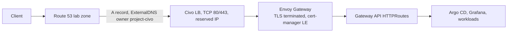
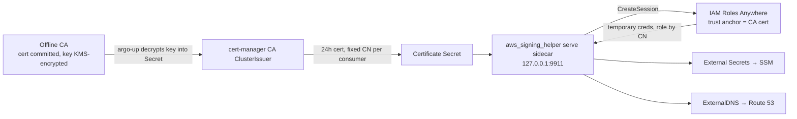
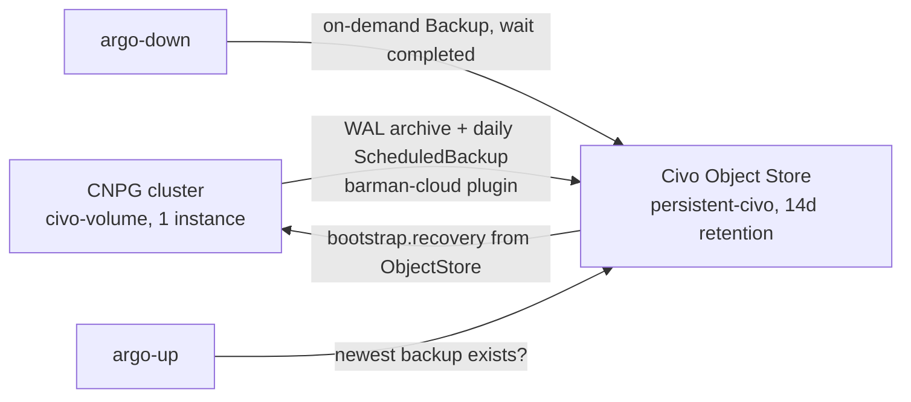

# Civo as a second provider — high-level design

**Status:** Living design document. Decisions below are dated; the detailed
planning package is `specs/civo/` (start at `specs/civo/README.md`).
**Inspected baseline:** branch `main`, commit `cfbb59bd340b6356bad3fb2493b41fa3a337efe5` (2026-09-06).

## 1. Purpose

Run the same platform (Argo CD, Envoy Gateway, CloudNativePG, External
Secrets, ExternalDNS, observability) on Civo managed Kubernetes next to the
existing AWS/EKS target, from one repository and one operator surface. AWS
stays the control plane for everything cheap and already built: Route 53,
SSM Parameter Store, KMS, the S3 state bucket, GitHub OIDC. Civo replaces
only the expensive compute path: EKS control plane, NLB, EC2 nodes, EBS.

Civo is a Kubernetes target, not a migration off AWS services.

## 2. Fixed constraints

| Constraint | Value | Decided |
|---|---|---|
| Operator surface | `PROVIDER=aws\|civo` on the existing `make` targets; default `aws`; no new lifecycle commands | 2026-09-06 |
| Civo project identity | `PROVIDER=civo` defaults `PROJECT_NAME=vk-civo-lab` and `SUBDOMAIN=civo`: own state bucket `vk-civo-lab-tf-state`, own zone `civo.<root-domain>`, own SSM prefix. Only the account layer is shared with the AWS project | 2026-09-06 |
| Stage model | Identical on both providers: `account-up` → `bootstrap-up` → `persistent-up` → `cluster-up` → `argo-up` (and the reverse) | 2026-09-06 |
| Cost target on Civo | 60–80 USD/month idle, all-in (nodes, LB, CNPG volume). Soft ceiling; bursts allowed. Review note 2026-09-06: with the full observability profile the expected M1 idle is closer to 100 USD (2 Large nodes) until CIVO-175 right-sizes | 2026-09-06 |
| Node plan | One `g4s.kube.large` pool (4 vCPU / 8 GB), fixed node count in M1. The cluster autoscaler moves to M2 (P3) because a personal Civo account has one API key, and the autoscaler would place that account-wide key in the cluster | 2026-09-06 |
| AWS workload identity from Civo | IAM Roles Anywhere; no long-lived AWS keys in workloads | 2026-09-06 |
| CA topology (M1) | Single offline CA: certificate committed, key KMS-encrypted in `secrets/` | 2026-09-06 |
| Civo API token | KMS-encrypted in repo (`secrets/civo-token.enc`), decrypted at run time, masked in CI; no GitHub secret, no SSM copy | 2026-09-06 |
| DNS | Route 53 stays authoritative; ExternalDNS writes from both providers with distinct owner IDs | 2026-09-06 |
| TLS on Civo | Terminated at Envoy Gateway with cert-manager + Let's Encrypt (HTTP-01 through Gateway API) | 2026-09-06 |
| Civo region | `LON1` default; `FRA1` alternative; declared once per layer, never derived | 2026-09-06 |
| Observability on Civo | Full profile in M1 (fits with the Large pool) | 2026-09-06 |
| AWS regression | AWS behavior stays byte-identical throughout; proven by a golden render diff and the existing lifecycle test | 2026-09-06 |
| Repository rule | Platform-only; no business application code | existing |

## 3. Stage model per provider

| Stage | `make` targets | AWS (`PROVIDER=aws`, default) | Civo (`PROVIDER=civo`) |
|---|---|---|---|
| Account (shared, once per AWS account, free) | `account-up/down` | KMS key, GitHub OIDC, `lab-role`, `eks-access-identity`, `root-domain` | Unchanged. `lab-role` gains scoped Roles Anywhere and IAM permissions. Civo has no account-level Terraform object; the API key is a manual one-time step |
| Bootstrap (per project, cheap, rarely destroyed) | `bootstrap-up/down` | Route 53 `lab.<root-domain>` zone, ACM certificate | Route 53 `civo.<root-domain>` zone (ACM unit excluded), plus `bootstrap/rolesanywhere`: trust anchor from the committed CA cert, profile, one IAM role per consumer |
| Persistent (data layer, survives `down`) | `persistent-up/down` | VPC, SSM secrets | SSM secrets (VPC unit excluded), plus `persistent-civo`: Civo network (free), reserved IP (stable LB address), and the Object Store holding CNPG backups (see §4.3) |
| Cluster (disposable) | `cluster-up/down` | EKS, system node group, Pod Identity roles, Karpenter IAM | `cluster-civo`: cluster firewall (6443) and LB firewall (80/443), k3s cluster with one Large pool, default Traefik and metrics-server removed, kubeconfig never stored in state |
| Argo (reconcile) | `argo-up/down` | Argo CD via script, root Application with `target=aws` | Same script, Civo branch: kubeconfig from the Civo CLI, CA key decrypted into the cert-manager issuer Secret, `target=civo` |

Composite targets are unchanged: `up`, `down`, `platform-up/down`,
`full-up/down`. `PROVIDER` is an operator input like `PROJECT_NAME`. Because
each provider is its own project (own state bucket, own zone), `make down`
with the default provider can only ever touch the AWS project; there is no
cross-provider ambiguity to guard against. Provider-specific unit exclusion
inside shared stacks uses Terragrunt's directory exclusion, so `bootstrap/`
and `persistent/` keep one directory each.

## 4. Target architecture

### 4.1 Traffic path



On AWS the NLB terminates TLS with ACM (ADR 0011). On Civo the LB is a
plain TCP forwarder and Envoy owns TLS (proposed ADR 0026).

### 4.2 Identity chain (AWS access from Civo workloads)



cert-manager itself needs no AWS credentials: Let's Encrypt HTTP-01 solves
through the Gateway. CNPG backups to object storage are a later spec
because CNPG pods cannot host the sidecar.

### 4.3 Persistence flow



Decided 2026-09-06 after review: the Civo CSI driver `csi.civo.com`
advertises no snapshot or clone capability in its source, so the AWS
snapshot flow (ADR 0013) cannot be mirrored. Persistence on Civo is
barman-cloud backups in a Civo Object Store (CIVO-180, CIVO-120). The
Civo volume itself is disposable. Object-store credentials are static
Civo keys delivered through SSM and ESO; the store costs about 5.43 USD
per month at the 500 GB minimum.

### 4.4 State layout

The Civo project gets its own S3 state bucket, `vk-civo-lab-tf-state`,
created by `make state-up` exactly as for the AWS project, with native
lockfiles. Keys derive from directory paths as today:

```
vk-civo-lab-tf-state/
  bootstrap/route53/terraform.tfstate           (lifecycle: bootstrap)
  bootstrap/rolesanywhere/terraform.tfstate     (lifecycle: bootstrap)
  persistent/secrets/terraform.tfstate          (lifecycle: persistent)
  persistent-civo/network/terraform.tfstate     (lifecycle: persistent)
  persistent-civo/reserved-ip/terraform.tfstate (lifecycle: persistent)
  cluster-civo/network/terraform.tfstate        (lifecycle: disposable)
  cluster-civo/k8s/terraform.tfstate            (lifecycle: disposable)
```

Shared, unchanged: `<owner>-account-state` (KMS, OIDC, lab-role,
root-domain). Separate stack directories keep `terragrunt run --all destroy`
scoped; separate buckets keep the two projects from ever seeing each other's
state. No existing state key moves.

## 5. Provider contract

What the shared GitOps tree needs from any provider, and where it comes from.

| Capability | Mandatory | AWS source | Civo source | Reaches Argo/Helm as |
|---|---|---|---|---|
| Kubernetes API access | yes | `aws eks update-kubeconfig` via `eks-access-identity` | `civo kubernetes config --save` using the decrypted token | kubeconfig context in scripts only |
| Environment/domain | yes | SSM `/<project>/bootstrap/route53/fqdn` | same | `envoyGateway.fqdn` |
| Dynamic RWO storage | yes | `ebs-delete` StorageClass | `civo-volume` (or `civo-retain`) | `storage.className` |
| Ingress endpoint | yes | NLB via ALB controller annotations | Civo LB via CCM annotations, reserved IP | `envoyGateway.service.annotations`, `envoyGateway.tls.mode` |
| DNS/TLS | yes | ExternalDNS + ACM at NLB | ExternalDNS + cert-manager at Envoy | `externalDns.txtOwnerId`, `certManager.enabled` |
| AWS identity for controllers | yes | EKS Pod Identity | Roles Anywhere sidecar | `awsIdentity.mode = podIdentity \| rolesAnywhere` |
| Secrets | yes | ESO → SSM | same, via sidecar | unchanged manifests |
| Schedulable capacity | yes | Karpenter NodePools | fixed pool + autoscaler | `capacity.spotAvoidance`, `postgres.nodeSelector` |
| GitOps | yes | Argo CD by script | same | `target` |
| PostgreSQL | yes | CNPG + EBS snapshots | CNPG + barman backups in Civo Object Store | `postgres.*` |
| Observability | optional | full stack | full stack, k3s scrape targets | `observability.*` |
| Policies | optional | none | none | — |

Values are set by `scripts/argo-up.sh` through the root Application's Helm
parameters, exactly as today. Provider-specific objects (EC2NodeClass,
EBS settings, LB annotations) stay inside the `aws` or `civo` template
subtrees; shared components read only the contract values.

## 6. Decision log

| Date | Decision | Rationale | Alternatives rejected |
|---|---|---|---|
| 2026-09-06 | `PROVIDER` variable on existing targets | Constitution §17: one command pair per lifecycle class; spec 027 reached the same conclusion with `TARGET` | `make civo-up` family |
| 2026-09-06 | `PROVIDER` is an operator input, not an ADR 0024 per-layer constant | It selects a stack directory; only the Civo region is a real constant | five-site declaration of PROVIDER |
| 2026-09-06 | One Large pool, fixed count in M1, soft 60–80 USD idle target | Memory is the blocker; three Medium nodes cannot host observability | 3 × Medium fixed (78 USD, ~7.8 GiB); RAM-optimized Small (78 USD per node) |
| 2026-09-06 | Cluster autoscaler deferred to M2 at P3 | Civo issues one API key per personal account; the autoscaler needs that account-wide key in `kube-system`, where a Secret reader gains full account control. Research recorded in CIVO-170 §12 | running it in M1 and accepting the exposure |
| 2026-09-06 | Right-sizing spec (CIVO-175) revisits requests/limits and memory-optimized SKUs | CPU is wasted on this workload; measured data first | deciding SKU now |
| 2026-09-06 | Roles Anywhere with a single offline CA | Free; external CA allowed; Private CA costs 50 USD/month; no Civo ServiceAccount OIDC issuer documented for web-identity federation | AWS Private CA; static AWS keys; web identity |
| 2026-09-06 | Civo token KMS-encrypted in repo | One secrets mechanism; CI already has KMS via OIDC; masked with `::add-mask::` | GitHub environment secret; SSM copy |
| 2026-09-06 | TLS at Envoy, Let's Encrypt HTTP-01 via Gateway API | No AWS credentials in cert-manager; LE rate limit handled by persisting the TLS Secret across `down`/`up` | DNS-01 with Route 53; provider-managed LB certificate |
| 2026-09-06 | Route 53 stays; ExternalDNS owner `<project>-civo` | Cheap, exists, constitution §14 ownership rule satisfied | Civo DNS |
| 2026-09-06 | Roles Anywhere resources in `bootstrap/`, Civo network + reserved IP in `persistent-civo/` | Matches the user's stage model: bootstrap = per project cheap, persistent = data layer | all in `persistent/` |
| 2026-09-06 | Full observability in M1 | Large pool has the headroom | reduced profile; deferral |
| 2026-09-06 | `LON1` default region | Civo home region, feature availability; pricing uniform | `FRA1` (kept as documented alternative) |
| 2026-09-06 | cert-manager installed on both targets behind a toggle, off on AWS | Shared chart, AWS unchanged | Civo-only install |
| 2026-09-06 | Civo is its own project: `vk-civo-lab`, subdomain `civo` | Separate state bucket, zone, SSM prefix, secrets; both clusters can run at once; account layer shared; no cross-provider guard logic | one project with provider-suffixed state keys |

## 7. Open questions

| Question | Blocks | Resolved by |
|---|---|---|
| Can a retained Civo volume be re-attached to a new cluster in the same network? | none (experiment only) | CIVO-020 spike |
| Is the 500 GB object-store minimum (~5.43 USD/month) acceptable? | CIVO-180 | user |
| Exact default application names to remove (`traefik2-nodeport`, `metrics-server`)? | CIVO-030 | CIVO-020 spike |
| Does Civo expose a ServiceAccount OIDC issuer (would allow web identity instead of Roles Anywhere)? | none (Roles Anywhere stays) | CIVO-020 spike, recheck |
| Reserved IP price | cost model precision | CIVO-025 |
| Helm chart support for `extraContainers` in ESO 2.9.0 and external-dns 1.21.1 | none | verified 2026-09-06: both charts expose `extraContainers`/`extraVolumes`; re-check at pinned versions |
| Civo autoscaler needs an API key in-cluster | CIVO-170 | dedicated second API key, ADR 0028 |

## 8. Where things live

- Planning package and index: `specs/civo/README.md`
- Detailed coupling inventory and change map: `specs/civo/architecture.md`
- Evidence and pricing: `specs/civo/research.md`
- Decisions and proposed ADR amendments: `specs/civo/decisions.md`
- Milestones and first PRs: `specs/civo/roadmap.md`
- Earlier research: `specs/027-alt-cloud-targets/spec.md` (superseded by this package)
- Proposed ADRs: 0025 (second target), 0026 (Envoy TLS on Civo), 0027 (Roles Anywhere), 0028 (Civo token)
