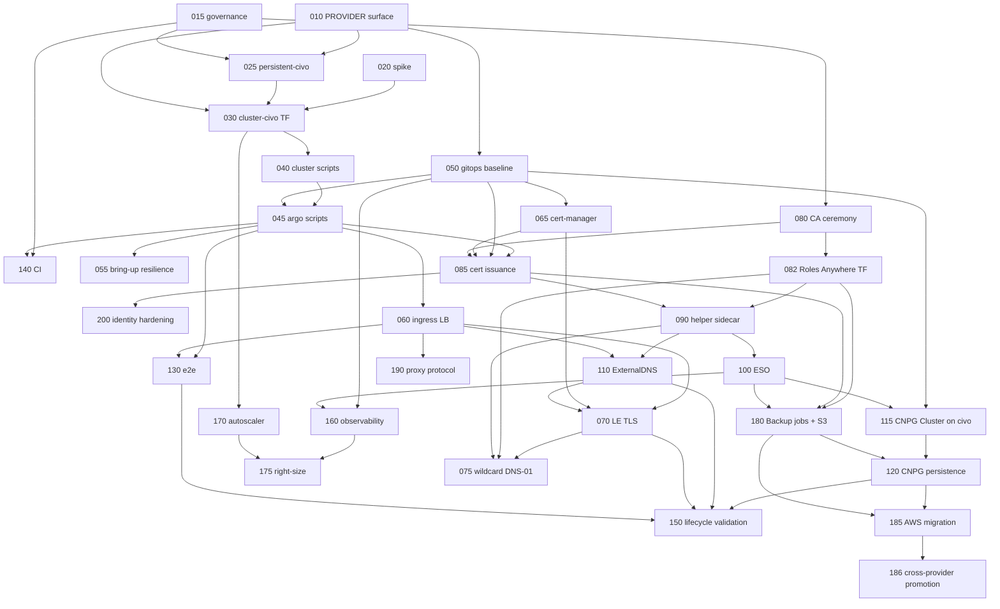

# Roadmap

## Milestones

| Milestone | Goal | Specs | Exit criterion |
|---|---|---|---|
| M0 Foundations | Operator surface, governance, feasibility facts | 010, 015, 020 | AWS unchanged; ADRs merged; spike report answers persistence and default-app questions |
| M1 Viable Civo platform | `PROVIDER=civo make full-up` brings up Argo, Envoy with TLS, DNS, ESO, CNPG with persistent backups, and observability on a fixed node pool; `make down`/`up` preserves data; CI can run it | 025–160, 180 | CIVO-150 lifecycle validation passes; idle cost recorded |
| M2 Hardening and optimization | AWS moves to the shared backups, cross-provider restore, autoscaler after the API-key research, right-sizing, client IP, identity hardening, wildcard TLS | 075, 170, 175, 185, 186, 190, 200 | each spec's DoD |

## Dependency graph

## Critical path

015 → 010 → 025 → 030 → 040 → 045 (with 050) → 065 → 080 → 082 → 085 → 090 → 100 → 115 → 180 → 120 → 150.

Parallel tracks once 045/050 land: ingress (060 → 070), identity (080 → 082 →
090 → 110), observability (160), tests (130), CI (140), autoscaler (170).

## First three PRs

1. **PR 1 — CIVO-010 + design docs.** `PROVIDER` operator input, civo defaults for project and subdomain, Make dispatch with AWS path unchanged; adds `docs/civo-high-level-design.md`, `docs/aws-platform-design.md`, `docs/argocd-design.md`, `docs/architecture-review-2026-09-06.md`, and `specs/civo/`. AWS regression: `make -n up` output identical; scripts unchanged for aws.
2. **PR 2 — CIVO-015.** ADRs 0025–0028, constitution §20, architecture §10a, documentation fixes from the review, `CLAUDE.md` updates, spec 027 superseded. No code.
3. **PR 3 — CIVO-020 report + CIVO-080 CA ceremony script.** Spike findings written into `research.md` and the spec; CA generation script and README exception, no cloud resources created by the PR itself (the spike cluster is created and destroyed manually during the spike session). The snapshot questions are already settled by the CSI source; the spike now confirms default-app names, allocatable memory, LB behavior, and object-store pricing.

## Requirement coverage

| Brief requirement | Covered by |
|---|---|
| One repo, two providers, common contract, shared GitOps above | 010, 050, architecture.md §4 |
| AWS behavior intact, no rewrite for symmetry | every spec's AWS regression section; 050 golden diff |
| Explicit provider differences, no conditional-heavy modules | separate modules and stacks (025, 030) |
| Terraform vs Argo ownership preserved | architecture.md §5; 045, 085 |
| Idempotent lifecycle, cost control, public-repo safety | 040, 045, 140, research.md cost model |
| Route 53 authoritative, SSM default secret store | 110, 100, decisions |
| Continue S3/SQS/Cognito where useful | none exist today; identity chain extensible (architecture.md §2 last row) |
| Roles Anywhere preferred; no permanent AWS keys | 080, 082, 085, 090 |
| No secrets in Git or examples | all specs; 080 ceremony |
| Sizing and cost with verified SKUs; replication cost stated | research.md; HLD §2; 120 (instances: 1) |
| Coupling inventory | architecture.md §2 |
| Capability verification with sources | research.md |
| Decisions A–I | architecture.md §6; HLD §6; decisions.md |
| Commands consistent with conventions | 010 |
| Bootstrap dependency cycles resolved | 085 (CA Secret before root Application), 070 (Secret re-import) |
| Ingress verification list | 060, 190 |
| DNS ownership, TXT owner IDs | 110, ADR 0002 note |
| Certificate flows separated (TLS vs workload identity) | 070 vs 085 |
| Storage verification list | 020, 120, 180 |
| CNPG sizing, backups, restore | 180 (bucket, IAM, image), 120 (jobs, lifecycle wiring, cycle proof), 185 (AWS migration), 186 (cross-provider restore) |
| Capacity comparison, fixed capacity allowed, autoscaler separate | 030 (fixed pool), 170 (deferred), 175 |
| Identity chain items 1–9 | 080 (2), 082 (1, 8), 085 (3, 4), 090 (6, 7, 9), 085/090 (5) |
| Civo token handling | 010, 040, 140, ADR 0030 |
| Destruction classification and recovery | 040, 045, 150 |
| Tests and CI gates | 130, 140, 150 |
| Costs with dated prices | research.md |
| Future agent compatibility | 050 non-goals note; no mandatory dependencies added |
