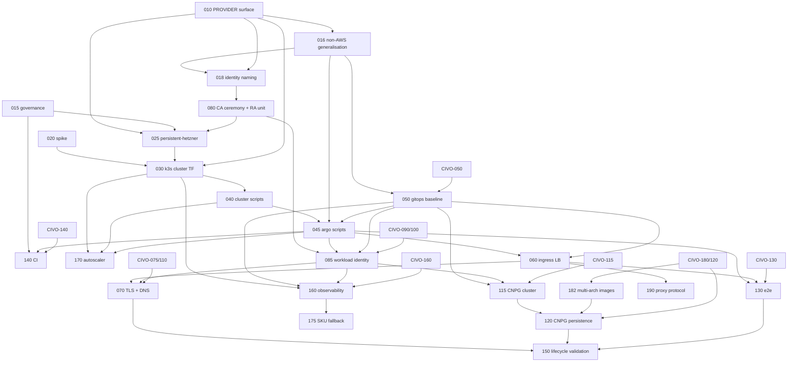

# Roadmap

## Milestones

| Milestone | Goal | Specs | Exit criterion |
|---|---|---|---|
| M0 Foundations | Operator surface, governance, the two generalisation refactors, feasibility facts | 010, 015, 016, 018, 020 | AWS and Civo unchanged (golden renders, `make -n`); ADRs merged; spike report answers the CCM-ordering, kubeconfig, volume-survival and LB-deletion questions |
| M1 Viable Hetzner platform | `PROVIDER=hetzner make full-up` brings up k3s on three CAX21, Argo, CCM/CSI, Envoy with wildcard TLS, DNS, ESO, CNPG with persistent dumps, observability; `make down`/`up` preserves data; CI can run it | 025–160, 182 | HETZ-150 passes; idle cost recorded against the 43 EUR model |
| M2 Scale and harden | Autoscaler 0–2, stock-aware SKU fallback, right-sizing, client IP | 170, 175, 190 | each spec's DoD |

## Dependency graph

## Critical path

015 → 010 → 016 → 018 → 080 → 025 → 030 → 040 → 045 (with 050) → 085 → 060 → 070 → 115 → 182 → 120 → 150. HETZ-020 has no code dependency and runs as soon as the Hetzner account, project and token exist.

Parallel tracks once 045/050 land: ingress (060 → 070), identity (085),
observability (160), tests (130), CI (140). 020 can run any time after the
Hetzner account, project and token exist; it has no code dependency.

## Cross-package gates

Hetzner M1 needs these Civo specs `DONE` first: 050, 075, 080, 082, 085,
090, 100, 110, 115, 120, 130, 140, 160, 180. At the baseline date
(2026-09-11) 115 is `IN_PROGRESS` and 120, 130, 140, 160, 180 are `READY`.
Hetzner specs that depend on them stay `BLOCKED` until then; the M0 specs
and 020, 025, 030, 040 do not.

## First three PRs

1. **PR 1 — HETZ-010 + this package.** `PROVIDER=hetzner` value, defaults, `hcloud_token()`, `secrets/hcloud-token.enc`, third arm in every guard and enum; adds `specs/hetzner/`. Regression: `make -n up` identical for `aws` and `civo`.
2. **PR 2 — HETZ-015.** ADR 0032, amendments to 0029/0030/0024/0002/0022, constitution §20 per-provider table, architecture §10a. No code.
3. **PR 3 — HETZ-016 + HETZ-018.** The two generalisation refactors with golden renders for `aws` and `civo` proving zero change, plus the Civo lifecycle test run once. These are the riskiest PRs in the package because they touch DONE Civo code; they go in before any Hetzner resource exists.

Then HETZ-020 (spike, manual session, no PR needed beyond the report), and
the M1 chain.

**Sequencing against `specs/local/`.** A parallel package adds `PROVIDER=local`
and edits the same sites: `Makefile:10`, `validateTarget`, `provider.sh`,
constitution §17/§20, architecture §10a, and it also claims ADR 0032. Land
PR 1 and PR 2 after the local package's 010/015 equivalents (or land the
shared guard and helper edits once for both), and renumber the Hetzner ADR
to the next free number at that time.

## Requirement coverage

| Brief requirement | Covered by |
|---|---|
| `PROVIDER=hetzner` in Make and GitHub Actions | 010, 140 |
| Hetzner-only make target that is a no-op elsewhere | none needed for the bootstrap (cloud-init inside `cluster-up`, decisions.md §1); `make node-ssh` in 040 |
| Terraform authentication to Hetzner | research.md (per-project token, `HCLOUD_TOKEN`), 010, 025 |
| Same setup as Civo where applicable | 016, 018, architecture.md §3 |
| Civo tasks that do not apply | architecture.md §3 rows marked n/a (reserved IP, k3s addon storage class) and decisions.md §4 |
| Same headers as Civo tasks | every `spec.md`; README format note |
| AWS access identical to Civo | 018, 080 |
| Cost within 50–100 USD with maximal CPU/memory | research.md cost model, shape A–E; 175 |
