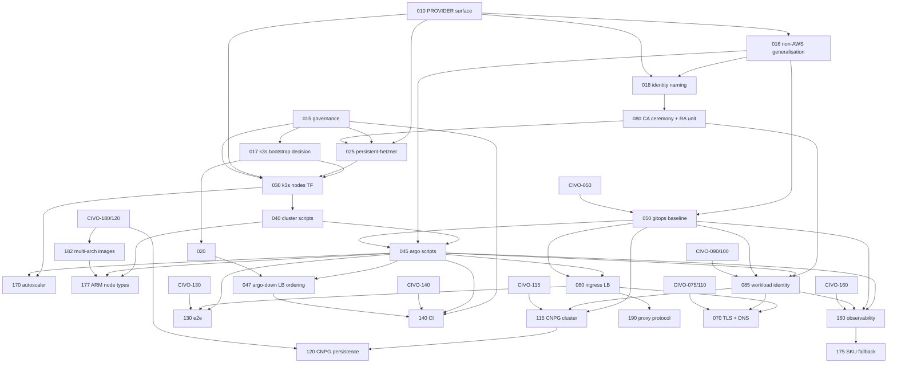

# Roadmap

## Milestones

| Milestone | Goal | Specs | Exit criterion |
|---|---|---|---|
| M0 Foundations | Operator surface, governance, the bootstrap decision, the two generalisation refactors, feasibility facts | 010, 015, 016, 017, 018, 020 | AWS and Civo unchanged (golden renders, `make -n`); ADRs merged; spike report answers the CCM-ordering, kubeconfig, volume-survival and LB-deletion questions |
| M1 Viable Hetzner platform | `PROVIDER=hetzner make full-up` brings up a k3s cluster (1 cp + 1 worker `cx33`, embedded etcd, flannel), the hcloud CCM, Argo, CSI, Envoy with wildcard TLS, DNS, ESO, CNPG with barman-cloud backups, observability, and the cluster autoscaler for 0–2 extra workers; `make down`/`up` preserves data; CI can run it | 025–170 | the CI lifecycle leg runs `up`, `test`, `down` green, CNPG data survives a `make down`/`make up` cycle (HETZ-120), and idle cost is recorded against the 32 EUR fixed / 53 EUR ceiling model (research.md shape F) |
| M2 Scale and harden | ARM (CAX) node types in the catalogue, stock-aware SKU fallback, arm64 images, client IP | 177, 175, 182, 190 | each spec's DoD |

## Dependency graph

## Critical path

015 → 017 → 010 → 016 → 018 → 080 → 025 → 030 → 040 → 045 (with 050) → 085 → 060 → 070 → 115 → 120. 047, 160 and 170 hang off 045 in parallel.

HETZ-177 is an M2 spec taken out of order, immediately after 040. On
2026-09-21 every x86 type in the catalogue was out of stock in both usable
Hetzner locations, including the default `cx33`, while the ARM line was
orderable in both at a third of the price of the only in-stock x86 equivalent.
Until the catalogue holds a line that can actually be ordered, every later
Hetzner spec is one stock check away from being unable to create a cluster.

Parallel tracks once 045/050 land: ingress (060 → 070), identity (085),
observability (160), tests (130), CI (140). 020 can run any time after the
Hetzner account, project and token exist; it has no code dependency.

## Cross-package gates

Hetzner M1 needs these Civo specs `DONE` first: 050, 075, 080, 082, 085,
090, 100, 110, 115, 120, 130, 140, 160, 180. At the baseline date
(2026-09-11) 115 is `IN_PROGRESS` and 120, 130, 140, 160, 180 are `READY`.
Hetzner specs that depend on them stay `BLOCKED` until then; the M0 specs
and 020, 025, 030, 040 do not.

## First three PRs

1. **PR 1 — HETZ-010 + this package.** `PROVIDER=hetzner` value, defaults, `hcloud_token()`, `secrets/hetzner-token.enc`, third arm in every guard and enum; adds `specs/hetzner/`. Regression: `make -n up` identical for `aws` and `civo`.
2. **PR 2 — HETZ-015.** ADR 0036, amendments to 0029/0030/0024/0002/0022, constitution §20 per-provider table, architecture §10a converted to a table, and the Hetzner columns in the shared non-EKS high-level design. No code.
3. **PR 3 — HETZ-016 + HETZ-018.** The two generalisation refactors with golden renders for `aws` and `civo` proving zero change, plus the Civo lifecycle test run once. These are the riskiest PRs in the package because they touch DONE Civo code; they go in before any Hetzner resource exists.

PRs 1 and 2 are merged. **HETZ-017** landed after them, on 2026-09-20: ADR 0037
replaces ADR 0036's bootstrap with k3s, four specs become `SUPERSEDED`, and
HETZ-030, 160 and 170 are rewritten. No code.

Then HETZ-020 (spike, manual session, no PR needed beyond the report), and
the M1 chain.

**Sequencing against `specs/local/`.** A parallel package adds `PROVIDER=local`
and edits the same sites: `Makefile:10`, `validateTarget`, `provider.sh`,
constitution §17/§20 and architecture §10a. Land PR 1 and PR 2 after the local
package's 010/015 equivalents, or land the shared guard and helper edits once
for both. **Updated 2026-09-20:** the ADR-number race recorded here does not
exist. `specs/local/` claims no ADR number at all, and 0032 to 0035 landed as
unrelated records, so the Hetzner ADR took 0036.

## Requirement coverage

| Brief requirement | Covered by |
|---|---|
| `PROVIDER=hetzner` in Make and GitHub Actions | 010, 140 |
| Hetzner-only make target that is a no-op elsewhere | none needed for the bootstrap (every node installs k3s from its own cloud-init, decisions.md §1); `make node-ssh` in 040 |
| Terraform authentication to Hetzner | research.md (per-project token, `HCLOUD_TOKEN`), 010, 025 |
| Same setup as Civo where applicable | 016, 018, architecture.md §3 |
| Civo tasks that do not apply | architecture.md §3 rows marked n/a (reserved IP, bundled StorageClass) and decisions.md §4 |
| Same headers as Civo tasks | every `spec.md`; README format note |
| AWS access identical to Civo | 018, 080 |
| Cost within 50–100 USD with maximal CPU/memory | research.md cost model, shape A–F; 175 (SKU fallback), SHARED-048 (right-sizing) |
