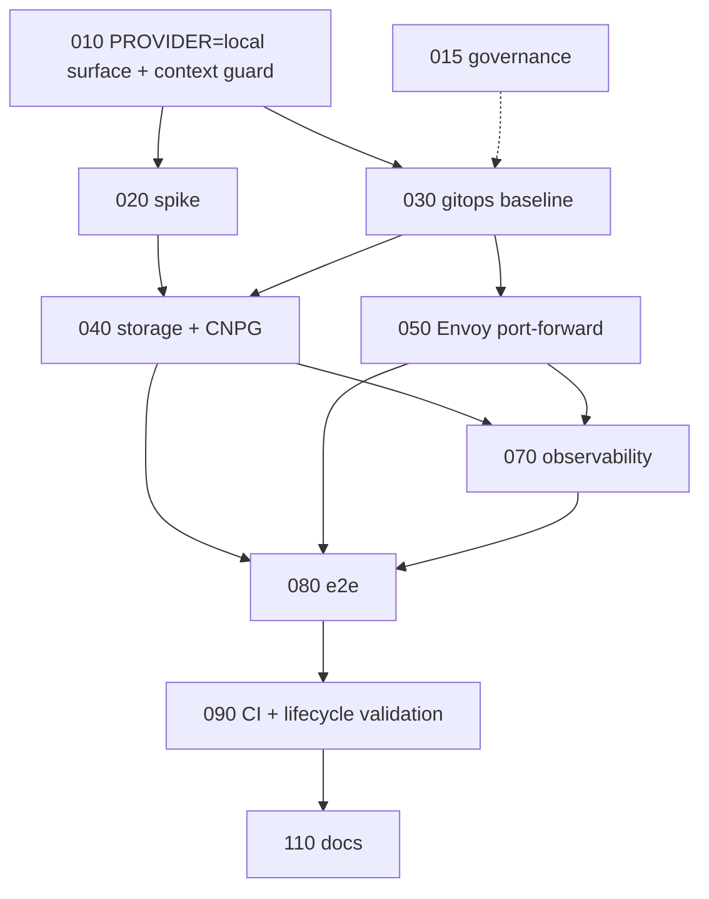

# Roadmap

## Milestones

| Milestone | Goal | Specs | Exit criterion |
|---|---|---|---|
| M0 Foundations | Command surface, governance, feasibility facts | 010, 015, 020 | `PROVIDER=local make up` on the developer's minikube installs Argo CD with an empty-but-valid root Application and refuses on a non-local context; ADR 0032 merged; spike answers the three storage/ingress questions |
| M1 Viable local platform | `PROVIDER=local make up` brings up Envoy, CNPG, and observability; `make test` passes; `down`/`up` keeps Postgres data; CI creates a kind cluster and runs it | 030, 040, 050, 070, 080, 090 | LOCAL-090 evidence recorded; `lifecycle-test.yml` green with `provider=local` |
| M2 Polish | Developer docs; optional drivers | 110, roadmap rows | each spec's DoD |

Roadmap rows without a spec (open until M1 evidence exists):

- default repo-folder mount for the node data path (per cluster tool)
- forward port 80 instead of 8080
- in-cluster Gitea for unpushed iteration

## Dependency graph

## Critical path

010 → 020 → 030 → 040 → 050 → 070 → 080 → 090.

015 runs in parallel with 010 and must land before any spec is marked
`DONE` on `main` (constitution §13: the ADR precedes the implementation).

## First three PRs

1. **PR 1 — LOCAL-015.** ADR 0032, constitution §17/§18/§20, architecture
   §10a, ADR 0006 superseded, specs 022/024 deleted, cross-references fixed.
   No code.
2. **PR 2 — LOCAL-010.** `PROVIDER=local` in `Makefile` and
   `scripts/lib/provider.sh`; context guard in `cluster-up`; local
   branches in `argo-up.sh`/`argo-down.sh`/`cluster-down.sh`/
   `require-persistent.sh`; `secrets/vk-local-lab/`.
   AWS regression: `make -n full-up` output identical for `PROVIDER=aws`;
   `make gitops-check` golden diff empty.
3. **PR 3 — LOCAL-020 report + LOCAL-030.** Spike findings written into
   `research.md`; `target=local` render contract inverted in
   `gitops-render-check.sh`, helpers and gates updated.

## Requirement coverage

| User requirement (2026-09-11) | Covered by |
|---|---|
| Run the platform on a local cluster with one or two commands | 010 (`full-up`/`up`), 110 |
| Review cloud services and replace what local does not need | architecture.md §2, 030, 040, 050, 070 |
| Ideally no cloud; KMS allowed for secrets | 010 (KMS decrypt only), decisions.md §1 |
| Delete root specs that describe a local solution | 015 |
| Reuse `argo-up`; the cluster is already there | 010 (local branch, same script; context guard, no cluster creation) |
| `PROVIDER=local` | 010, 015 |
| Port-forward instead of DNS | 050, 080 |
| E2E tests point at local and pass | 080 |
| Local disk for CNPG, no backups; repo folder optional | 040, 110 |
| Default `project_name=vk-local-lab` | 010 |
| GitHub Action that boots a cluster and runs the setup | 090 (the workflow creates kind, then `make up`) |
| Same headers as civo specs | every spec; README format note |
| High-level considerations and review approach | architecture.md, research.md, this file |
